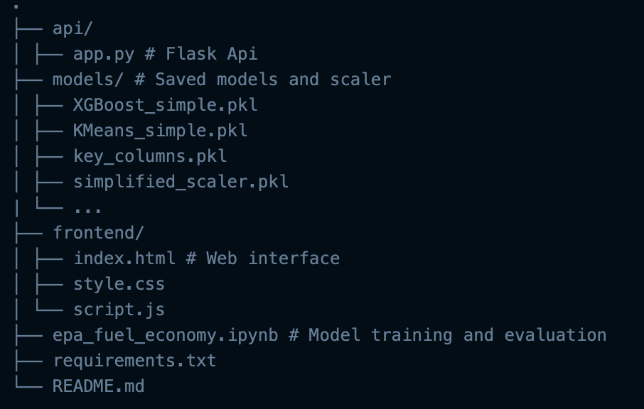

# 🚗 Fuel Efficiency Prediction & Vehicle Clustering using Machine Learning

## 📘 Overview

This project provides a complete end-to-end machine learning pipeline to predict a vehicle’s **city MPG (miles per gallon)** and classify vehicles into distinct **clusters based on key features**. It includes data preprocessing, training supervised and unsupervised models, and deploying a web-based interface using **Flask + JavaScript**.

---

## 🧩 Problem Statement

Fuel economy is a critical factor for consumers, manufacturers, and policy makers. Accurate prediction of a vehicle's fuel efficiency enables better decision-making, smarter purchases, and informed design and regulation.

This project aims to:

- ✅ Predict a car’s fuel efficiency (city MPG) based on engine, transmission, and build characteristics using supervised ML.
- ✅ Cluster vehicles into meaningful categories (e.g., Economy, SUV, Performance) using unsupervised ML.
- ✅ Offer an intuitive web interface for real-time prediction and clustering.

---

## 📊 Dataset

- **Source**: U.S. EPA Fuel Economy Dataset (2023+ filtered)
- **Format**: CSV, structured, 1000+ rows and 30+ features
- **Target Variable**: `city_mpg` (City Miles per Gallon)
- **Features used**: Engine displacement, cylinder count, transmission type, drive system, carline class, SmartWay certification, fuel type, and engineered variables like `engine_efficiency`.

---

## 🧠 ML Techniques

### ✅ Supervised Learning (Regression)

- **Models**: XGBoost, LightGBM, Random Forest, Linear Regression, Decision Tree, SVR, KNN, Gradient Boosting, MLP, Logistic Regression (binary variant)
- **Metrics**: R², RMSE, MAE

### ✅ Unsupervised Learning (Clustering)

- **Models**: KMeans, Birch, Agglomerative, MiniBatchKMeans, Spectral, Gaussian Mixture
- **Evaluation**: Silhouette score, PCA visualization

---

## 🖥 Features

- 📈 Predict City MPG from 7 key vehicle input features
- 🧠 Classify vehicles into behavioral clusters (e.g., SUV, Compact)
- 🌐 Interactive frontend using HTML/CSS/JS
- 🐍 Flask backend serving machine learning predictions
- 💾 Models and preprocessing objects saved using `joblib`

---

## ⚙️ Tech Stack

- **Frontend**: HTML, CSS, JavaScript
- **Backend**: Python, Flask
- **ML/EDA**: scikit-learn, XGBoost, LightGBM, pandas, numpy, seaborn, matplotlib
- **Model Deployment**: Flask + CORS
- **Visualization**: PCA, Seaborn heatmaps, correlation plots

---

## 🛠️ Setup Instructions

### 📦 1. Clone the Repository

```bash
git clone https://github.com/TarunZach/fuel_mpg_prediction
cd fuel_mpg_prediction
```

### 🐍 2. Set Up Virtual Environment

```bash
python3 -m venv ml-env
source ml-env/bin/activate  # On Windows: ml-env\Scripts\activate
pip install -r requirements.txt
```

### 🧠 3. Train & Save Models

Run the training notebook:

```bash
# Open and Run epa_fuel_economy.ipynb
```

This will generate:

- XGBoost_simple.pkl
- KMeans_simple.pkl
- simplified_scaler.pkl
- key_columns.pkl
- ...

Inside /models

### 🔥 4. Run the Flask Server

```bash
cd api/
python app.py
```

By default, the server runs on http://127.0.0.1:5000

### 🌐 5. Launch the frontend

Open frontend/index.html directly in a browser, or use Live Server.

### 🗂 Project Structure



### 🚀 Future Improvements

- Add support for additional clustering models (Agglomerative, Spectral, etc.)
- Containerize app using Docker
- Deploy backend with Gunicorn + Nginx
- Enhanced cluster labeling via domain expert input

### 👨‍💻 Author

Developed by Tarun Zacharias Akkarakalam

University of Europe for Applied Sciences
